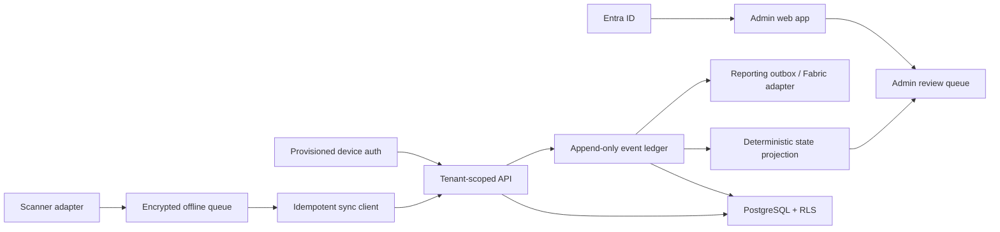

# Foundation architecture

## Time evidence

Every observation keeps three different times because they answer different questions:

| Field | Meaning | Use |
|---|---|---|
| `device_observed_at` | Raw time shown by the device when the employee acted | Audit evidence and diagnostics |
| `effective_at` | Observed time adjusted by the last measured device/server offset | Timeline projection and operational reporting |
| `received_at` | Time the server received the record | Sync diagnosis, latency, and ingestion audit |

Offline duration is the difference between effective and receipt time; it is not automatically a bad device clock. If no offset measurement exists, effective time initially equals observed time and the event still retains its other ordering evidence.

## Ordering evidence

The mobile installation creates one UUID and persists it in secure local storage. Every queued event receives the next sequence number before it is displayed as saved. The ledger stores sequence collisions rather than losing one record; a collision opens a review case because the device history is ambiguous.

## Conflict philosophy

An intake result has two independent dimensions:

- Was the observation preserved? A structurally valid, authorized, idempotent observation normally is.
- Can it safely update current state? Only if the timeline remains unambiguous.

This distinction lets the system accept conflicting offline evidence without pretending two incompatible states are simultaneously correct. Admin resolution is an additional append-only action with a mandatory reason.

## Unannounced movement and reconciliation

The location employee is not expected to know the receiving site. A departure
therefore records only the site where the container left and projects an open
`In transit` state. The next `batch_in`, `load_assigned`, or `emptied` scan at a
different physical location can be the first evidence that the container is
there. StackTrack preserves that newer physical evidence and moves the current
projection to the observed site, but adds `LocationChangeWithoutDeparture` and
opens review because the handoff is incomplete. This is intentionally different
from silently ignoring the later scan or inventing a destination.

If another `batch_out` arrives before any `batch_in`, the newer departure is
also retained, while `RepeatedDepartureBeforeArrival` marks the open movement
for review. This covers duplicate departure taps, an unrecorded intermediate
arrival, and a multi-hop journey whose first leg was never closed. A normal
departure followed by a receiving scan remains clean. All of these decisions
are deterministic and can be replayed from the append-only event set.

If a loaded container is processed at a different site while its departure is
still open, the processing scan is kept as the newest physical evidence but
receives `ProcessingWithoutReceipt`. The projection can show the useful site
and empty state without implying that a receiving scan was recorded. A later
arrival or an approved correction can close the ambiguity; neither action edits
the original observations.
