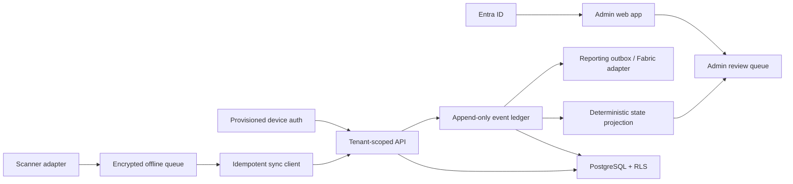

# Foundation architecture

## Time evidence

Every observation keeps three different times because they answer different questions:

| Field | Meaning | Use |
|---|---|---|
| `device_observed_at` | Raw time shown by the device when the employee acted | Audit evidence and diagnostics |
| `effective_at` | Observed time adjusted by the last measured device/server offset | Timeline projection and operational reporting |
| `received_at` | Time the server received the record | Sync diagnosis, latency, and ingestion audit |

Offline duration is the difference between effective and receipt time; it is not automatically a bad device clock. If no offset measurement exists, effective time initially equals observed time and the event still retains its other ordering evidence.

## Ordering evidence

The mobile installation creates one UUID and persists it in secure local storage. Every queued event receives the next sequence number before it is displayed as saved. The ledger stores sequence collisions rather than losing one record; a collision opens a review case because the device history is ambiguous.

## Conflict philosophy

An intake result has two independent dimensions:

- Was the observation preserved? A structurally valid, authorized, idempotent observation normally is.
- Can it safely update current state? Only if the timeline remains unambiguous.

This distinction lets the system accept conflicting offline evidence without pretending two incompatible states are simultaneously correct. Admin resolution is an additional append-only action with a mandatory reason.

